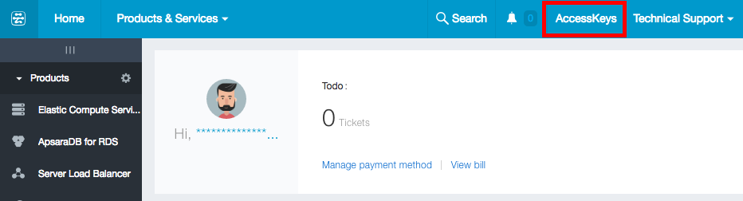
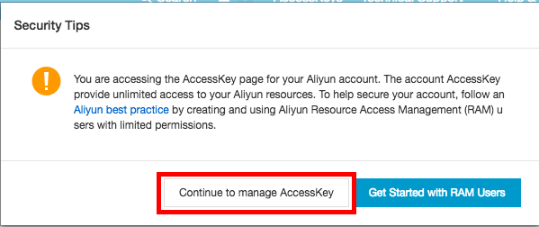
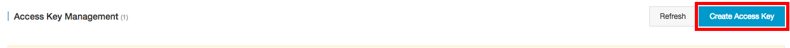
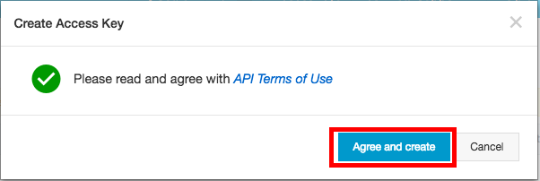
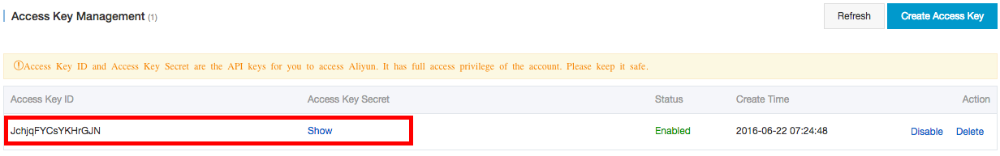

# aliyuncli - Getting Started Guide

## 0. Index

## 1. aliyuncliの設定

aliyuncliを使用して、Alibaba Cloudのリソースを管理のに事前に設定が必要です。設定項目は以下の通りです：
 - Access Key: Access Key IDとAccess Key Secretを設定する
 - Default Region ID: デフォルトで使用するRegionIdを指定
 - 出力フォーマット: json, table, textから出力フォーマットを選択

### 事前作業：Access Key IDとAccess Key Secretを取得する

Access Key Management Refreshコンソールを開く



Continue to manage AccessKey




Access Keyを生成する



承諾



生成されたAccessKeyが確認できます。IDとSecretをコピーし、aliyuncliの設定を行います。Secretを表示するには"Show"のボタンをクリック。



### aliyuncliを設定する
```
$ aliyuncli configure
Aliyun Access Key ID [****************yHnT]:
Aliyun Access Key Secret [****************AvzQ]:
Default Region Id [cn-hangzhou]:
Default output format [table]:
```
`configure list`で設定内容が確認できる
```
$ aliyuncli configure list
      Name                Value            Type                Location
      ----                -----            ----                --------
   Profile                 None            None                    None
Access_Key ****************yHnT     credentials    /Users/sarre27/.aliyuncli/credentials
Secret_Key ****************AvzQ     credentials    /Users/sarre27/.aliyuncli/credentials
    Region          cn-hangzhou       configure    /Users/sarre27/.aliyuncli/configure
    Output                table       configure    /Users/sarre27/.aliyuncli/configure
```
以降、`aliyuncli`コマンド使用時は設定したAccessKey、RegionIdと出力方法が使用される。
例：Region一覧を表示する
```
$ aliyuncli ecs DescribeRegions --filter Regions.Region[*].RegionId
--------------------
|  DescribeRegions |
+------------------+
|  ap-southeast-1  |
|  cn-shenzhen     |
|  cn-qingdao      |
|  cn-beijing      |
|  cn-shanghai     |
|  us-east-1       |
|  cn-hongkong     |
|  cn-hangzhou     |
|  us-west-1       |
+------------------+
```
コマンドを実行する時に別のAccessKey、RegionIdと出力方法の指定が可能。使用するオプションは以下の通り：
 - --AccessKeyId:  Access Key IDを指定
 - --AccessKeySecret: Access Key Secretを指定
 - --RegionId: Region Idを指定
 - --output: 結果出力フォーマットを指定(json, table, text)

例:Region一覧を表示する。
```
$ aliyuncli ecs DescribeRegions --filter Regions.Region[*].RegionId --AccessKeyId ****************rGJN --AccessKeySecret ****************GtJS --RegionId us-east-1 --output json
[
    "ap-southeast-1",
    "cn-shenzhen",
    "cn-qingdao",
    "cn-beijing",
    "cn-shanghai",
    "us-east-1",
    "cn-hongkong",
    "cn-hangzhou",
    "us-west-1"
]
```


プロファイルを作成して複数アカウント（AccessKey）の設定も可能。
ebsarrプロファイルで別のアカウントを設定
```
$ aliyuncli configure --profile ebsarr
Aliyun Access Key ID [None]: ****************rGJN
Aliyun Access Key Secret [None]: ****************GtJS
Default Region Id [None]: ap-southeast-1
Default output format [None]: table
```
`configure list`で設定内容を確認
```
$ aliyuncli configure list --profile ebsarr
      Name                Value            Type                Location
      ----                -----            ----                --------
   Profile               ebsarr            None                    None
Access_Key ****************rGJN     credentials    /Users/sarre27/.aliyuncli/credentials
Secret_Key ****************GtJS     credentials    /Users/sarre27/.aliyuncli/credentials
    Region       ap-southeast-1       configure    /Users/sarre27/.aliyuncli/configure
    Output                table       configure    /Users/sarre27/.aliyuncli/configure
```

設定したプロファイルを使用して実行する場合、`--profile`オプションを使用する
<br>例：Region一覧を表示する
```
$ aliyuncli ecs DescribeRegions --profile ebsarr --filter Regions.Region[*].RegionId
--------------------
|  DescribeRegions |
+------------------+
|  ap-southeast-1  |
|  cn-shenzhen     |
|  cn-qingdao      |
|  cn-beijing      |
|  cn-shanghai     |
|  us-east-1       |
|  cn-hongkong     |
|  cn-hangzhou     |
|  us-west-1       |
+------------------+
```