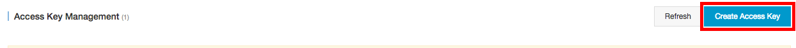
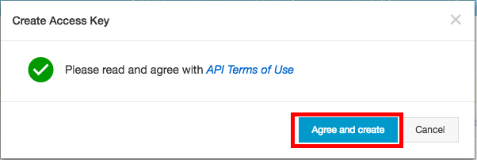
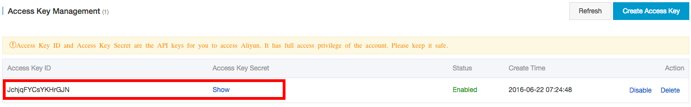

# aliyuncli - Getting Started Guide

## 0. Index
 - [インストール手順](#1-インストール手順)
 - [Debian系システムの場合](#2-debian系システムの場合)
 - [Windowsの場合](#3-windowsの場合)
 - [AutoCompleteの設定（オプション）](#4-autocompleteの設定)
 - [aliyuncliの設定](#5-aliyuncliの設定)
 - [その他主要オピションの使用](#6-その他主要オピション：パジネーション)
 

## 1. インストール手順

### 1.1 pipのインストール
すでにpipがインストールされている場合はこの手順をスキップして下さい。
<br>
**NOTE:** Windowsユーザは[事前にpythonとpipをインストールして下さい]()
```
$ curl https://bootstrap.pypa.io/get-pip.py | sudo python
```

### 1.2 aliyuncliのインストール
**NOTE:** Debian系システムの場合は[この手順に従って実施して下さい](#2-debian系システムの場合)
```
$ sudo pip install aliyuncli
```

事後確認
```
$ aliyuncli
usage: aliyuncli <command> <operation> [options and parameters]
<aliyuncli> the valid command as follows:
```
実行可能なコマンドは表示されません。ecsやossなど、プロダクト毎のSDKをインストールして、コマンドを追加します。
<br>
以下のSDKをインストールしてしてコマンドを追加します：
- ECS: aliyun-python-sdk-ecs
- RDS: aliyun-python-sdk-rds
- SLB: aliyun-python-sdk-slb
- OSS: aliyun-python-sdk-oss

```
$ sudo pip install aliyun-python-sdk-ecs
$ sudo pip install aliyun-python-sdk-rds
$ sudo pip install aliyun-python-sdk-slb
$ sudo pip install aliyun-python-sdk-oss
```
事後確認
```
$ aliyuncli
usage: aliyuncli <command> <operation> [options and parameters]
<aliyuncli> the valid command as follows:

ecs                                       | oss
rds                                       | slb
```
インストールしたプロダクトごとのSDKが利用可能なコマンドとして表示されます。

## 2. Debian系システムの場合
以下の方法で`aliyuncli`と各SDKをインストールします。
```
$ dist_packages=$( python -c "from distutils.sysconfig import get_python_lib; print(get_python_lib())" )
$ sudo pip install --install-option="--install-purelib=${dist_packages}" aliyuncli
$ sudo pip install --install-option="--install-purelib=${dist_packages}" aliyun-python-sdk-ecs
$ sudo pip install --install-option="--install-purelib=${dist_packages}" aliyun-python-sdk-rds
$ sudo pip install --install-option="--install-purelib=${dist_packages}" aliyun-python-sdk-slb
$ sudo pip install --install-option="--install-purelib=${dist_packages}" aliyun-python-sdk-oss
```
事後確認
```
$ aliyuncli
usage: aliyuncli <command> <operation> [options and parameters]
<aliyuncli> the valid command as follows:

ecs                                       | oss
rds                                       | slb
```

## 3. Windowsの場合

`aliyuncli`はpythonで動いていますので、事前にpythonをインストールする必要があります。インストール済みの場合はこの手順をスキップして下さい。
<br>
[このページ](https://www.python.org/downloads/release/python-2711/)から最新のpythonイントーラを入手し、インストールをして下さい。この時、インストールオプションの中から`pip`ツールが選択されていることを確認して下さい。。
<br>
**NOTE:** 現在は`aliyuncli`が`python3`に対応しておりませんので、`python2`をインストールして下さい。
<br>
pythonのインストール完了後、[1.2 aliyuncliのインストール手順](#12-aliyuncliのインストール)に従って`aliyuncli`と各SDKをインストールして下さい。

## 4. AutoCompleteの設定
Linuxの場合は、AutoCompleteの設定が可能です。
```
complete -C `which aliyun_completer` aliyuncli
```
次回ログイン以降もこの設定を反映させたい場合は`~/.bash_profile`などにこのコマンドを追加して下さい。

## 5. aliyuncliの設定

aliyuncliを使用して、Alibaba Cloudのリソースを管理のに事前に設定が必要です。設定項目は以下の通りです：
 - Access Key: Access Key IDとAccess Key Secretを設定する
 - Default Region ID: デフォルトで使用するRegionIdを指定
 - 出力フォーマット: json, table, textから出力フォーマットを選択

### 事前作業：Access Key IDとAccess Key Secretを取得する

Access Key Management Refreshコンソールを開く


Continue to manage AccessKey


Access Keyを生成する



承諾



生成されたAccessKeyが確認できます。IDとSecretをコピーし、aliyuncliの設定を行います。Secretを表示するには"Show"のボタンをクリック。



### aliyuncliを設定する
```
$ aliyuncli configure
Aliyun Access Key ID [****************yHnT]:
Aliyun Access Key Secret [****************AvzQ]:
Default Region Id [cn-hangzhou]:
Default output format [table]:
```
`configure list`で設定内容が確認できる
```
$ aliyuncli configure list
      Name                Value            Type                Location
      ----                -----            ----                --------
   Profile                 None            None                    None
Access_Key ****************yHnT     credentials    /Users/sarre27/.aliyuncli/credentials
Secret_Key ****************AvzQ     credentials    /Users/sarre27/.aliyuncli/credentials
    Region          cn-hangzhou       configure    /Users/sarre27/.aliyuncli/configure
    Output                table       configure    /Users/sarre27/.aliyuncli/configure
```
以降、`aliyuncli`コマンド使用時は設定したAccessKey、RegionIdと出力フォーマットが使用される。
例：Region一覧を表示する
```
$ aliyuncli ecs DescribeRegions --filter Regions.Region[*].RegionId
--------------------
|  DescribeRegions |
+------------------+
|  ap-southeast-1  |
|  cn-shenzhen     |
|  cn-qingdao      |
|  cn-beijing      |
|  cn-shanghai     |
|  us-east-1       |
|  cn-hongkong     |
|  cn-hangzhou     |
|  us-west-1       |
+------------------+
```
コマンドを実行する時に別のAccessKey、RegionIdと出力フォーマットの指定が可能。使用するオプションは以下の通り：
 - --AccessKeyId:  Access Key IDを指定
 - --AccessKeySecret: Access Key Secretを指定
 - --RegionId: Region Idを指定
 - --output: 結果出力フォーマットを指定(json, table, text)

例:Region一覧を表示する。
```
$ aliyuncli ecs DescribeRegions --filter Regions.Region[*].RegionId --AccessKeyId ****************rGJN --AccessKeySecret ****************GtJS --RegionId us-east-1 --output json
[
    "ap-southeast-1",
    "cn-shenzhen",
    "cn-qingdao",
    "cn-beijing",
    "cn-shanghai",
    "us-east-1",
    "cn-hongkong",
    "cn-hangzhou",
    "us-west-1"
]
```


プロファイルを作成して複数アカウント（AccessKey）の設定も可能。Access KeyとIDをコマンドラインで入力するのは望ましくないので、複数のアカウントを使用する場合はプロファイルの設定をお勧めします。
<br>ebsarrプロファイルで別のアカウントを設定
```
$ aliyuncli configure --profile ebsarr
Aliyun Access Key ID [None]: ****************rGJN
Aliyun Access Key Secret [None]: ****************GtJS
Default Region Id [None]: ap-southeast-1
Default output format [None]: table
```
`configure list`で設定内容を確認
```
$ aliyuncli configure list --profile ebsarr
      Name                Value            Type                Location
      ----                -----            ----                --------
   Profile               ebsarr            None                    None
Access_Key ****************rGJN     credentials    /Users/sarre27/.aliyuncli/credentials
Secret_Key ****************GtJS     credentials    /Users/sarre27/.aliyuncli/credentials
    Region       ap-southeast-1       configure    /Users/sarre27/.aliyuncli/configure
    Output                table       configure    /Users/sarre27/.aliyuncli/configure
```

設定したプロファイルを使用して実行する場合、`--profile`オプションを使用する
<br>例：Region一覧を表示する
```
$ aliyuncli ecs DescribeRegions --profile ebsarr --filter Regions.Region[*].RegionId
--------------------
|  DescribeRegions |
+------------------+
|  ap-southeast-1  |
|  cn-shenzhen     |
|  cn-qingdao      |
|  cn-beijing      |
|  cn-shanghai     |
|  us-east-1       |
|  cn-hongkong     |
|  cn-hangzhou     |
|  us-west-1       |
+------------------+
```

## 6. その他主要オピション：パジネーション

OSイメージ一覧の表示など、出力アイテム数が多い時は先頭の10アイテムしか表示されないです。その以上のアイテムを表示する場合はベージサイズやページ番号してい用のオプションを使用すると良いです。
例：利用可能なイメージ一覧を表示する
```
$ aliyuncli ecs DescribeImages --filter Images.Image[*].ImageId
---------------------------------------------
|              DescribeImages               |
+-------------------------------------------+
|  suse12sp1_64_40G_cloudinit_20160520.vhd  |
|  debian804_64_40G_cloudinit_20160520.raw  |
|  m-23zwrpk9w                              |
|  ubuntu1404_64_40G_aliaegis_20160222.vhd  |
|  ubuntu1404_32_40G_aliaegis_20160222.vhd  |
|  ubuntu1204_64_40G_aliaegis_20160222.vhd  |
|  ubuntu1204_32_40G_aliaegis_20160222.vhd  |
|  suse11sp3_64_40G_aliaegis_20160222.vhd   |
|  suse11sp2_64_40G_aliaegis_20160222.vhd   |
|  suse11sp1_64_40G_aliaegis_20160222.vhd   |
+-------------------------------------------+
```
上記の通り、10件しか表示されない。フィルターなしで実行すると、合計イメージ数がわかります。
```
--------------------------------------------------------------------------
|                             DescribeImages                             |
+-----------------+------------------------------------------------------+
|  PageNumber     |  1                                                   |
|  PageSize       |  10                                                  |
|  RegionId       |  cn-hangzhou                                         |
|  RequestId      |  0FEB4490-3124-43DE-8DA9-A77EF5A667F4                |
|  TotalCount     |  41                                                  |
+-----------------+------------------------------------------------------+
```
TotalCountカウントが41なので、合計41件あります。この例です全て表示する場合は`--PageSize 50`を指定すると良い
```
$ aliyuncli ecs DescribeImages --PageSize 100 --filter Images.Image[*].ImageId
-------------------------------------------------------
|                   DescribeImages                    |
+-----------------------------------------------------+
|  suse12sp1_64_40G_cloudinit_20160520.vhd            |
|  debian804_64_40G_cloudinit_20160520.raw            |
|  m-23zwrpk9w                                        |
|  ubuntu1404_64_40G_aliaegis_20160222.vhd            |
|  ubuntu1404_32_40G_aliaegis_20160222.vhd            |
|  ubuntu1204_64_40G_aliaegis_20160222.vhd            |
|  ubuntu1204_32_40G_aliaegis_20160222.vhd            |
|  suse11sp3_64_40G_aliaegis_20160222.vhd             |
|  suse11sp2_64_40G_aliaegis_20160222.vhd             |
|  suse11sp1_64_40G_aliaegis_20160222.vhd             |
|  gentoo13_64_40G_aliaegis_20160222.vhd              |
|  debian750_64_40G_aliaegis_20160222.vhd             |
|  debian750_32_40G_aliaegis_20160222.vhd             |
|  debian609_64_40G_aliaegis_20160222.vhd             |
|  debian609_32_40G_aliaegis_20160222.vhd             |
|  coreos681_64_40G_aliaegis_20160222.vhd             |
|  centos6u5_64_40G_aliaegis_20160222.vhd             |
|  centos6u5_32_40G_aliaegis_20160222.vhd             |
|  aliyun1501_64_40G_aliaegis_20160222.vhd            |
|  aliyun1501_32_40G_aliaegis_20160222.vhd            |
|  win2012_64_dataCtr_R2_en_40G_alibase_20151212.vhd  |
|  win2012_64_dataCtr_R2_cn_40G_alibase_20151212.vhd  |
|  win2008_64_ent_r2_en_40G_alibase_20151212.vhd      |
|  win2008_64_ent_r2_cn_40G_alibase_20151212.vhd      |
|  win2008_32_stand_sp2_cn_40G_alibase_20151212.vhd   |
|  opensuse1301_64_40G_aliaegis_20160120.vhd          |
|  opensuse1301_32_40G_aliaegis_20160120.vhd          |
|  freebsd1001_64_40G_aliaegis_20160120.vhd           |
|  centos7u0_64_40G_aliaegis_20160120.vhd             |
|  centos5u8_64_40G_aliaegis_20160120.vhd             |
|  centos5u10_64_40G_aliaegis_20160120.vhd            |
|  centos5u10_32_40G_aliaegis_20160120.vhd            |
|  win2012_64_stand_cn_40G_alibase_20150429.vhd       |
|  win2012_64_stand_en_40G_alibase_20150429.vhd       |
|  win2008_64_stand_r2_en_40G_alibase_20150429.vhd    |
|  win2008_64_stand_r2_cn_40G_alibase_20150429.vhd    |
|  win2003_64_ent_r2_en_40G_alibase_20141223.vhd      |
|  win2003_64_ent_r2_cn_40G_alibase_20141223.vhd      |
|  win2003_64_stand_r2_en_40G_alibase_20141114.vhd    |
|  win2003_64_stand_r2_cn_40G_alibase_20141114.vhd    |
|  win2003_32_stand_r2_cn_40G_alibase_20141114.vhd    |
+-----------------------------------------------------+
```
また、ページサイズはデフォルト10まま、ページ番号を指定することで、スクロールすることが可能
```
$ aliyuncli ecs DescribeImages --PageNumber 2
-------------------------------------------------------------------------
|                            DescribeImages                             |
+-----------------+-----------------------------------------------------+
|  PageNumber     |  2                                                  |
|  PageSize       |  10                                                 |
|  RegionId       |  cn-hangzhou                                        |
|  RequestId      |  28264E12-4700-41BB-A16D-EA951227E654               |
|  TotalCount     |  41                                                 |
+-----------------+-----------------------------------------------------+
```

```
$ aliyuncli ecs DescribeImages --PageNumber 2 --filter Images.Image[*].ImageId
---------------------------------------------
|              DescribeImages               |
+-------------------------------------------+
|  gentoo13_64_40G_aliaegis_20160222.vhd    |
|  debian750_64_40G_aliaegis_20160222.vhd   |
|  debian750_32_40G_aliaegis_20160222.vhd   |
|  debian609_64_40G_aliaegis_20160222.vhd   |
|  debian609_32_40G_aliaegis_20160222.vhd   |
|  coreos681_64_40G_aliaegis_20160222.vhd   |
|  centos6u5_64_40G_aliaegis_20160222.vhd   |
|  centos6u5_32_40G_aliaegis_20160222.vhd   |
|  aliyun1501_64_40G_aliaegis_20160222.vhd  |
|  aliyun1501_32_40G_aliaegis_20160222.vhd  |
+-------------------------------------------+
```
